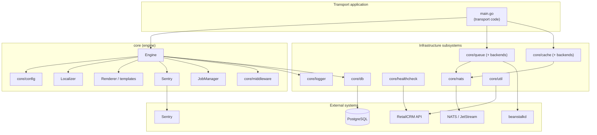
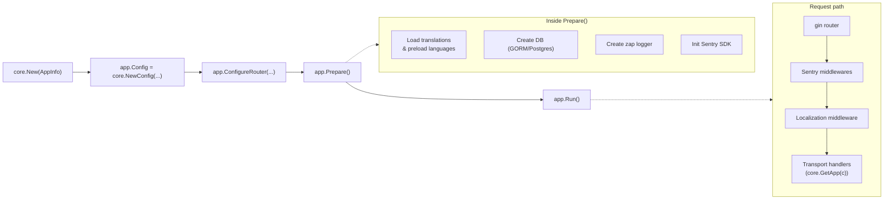
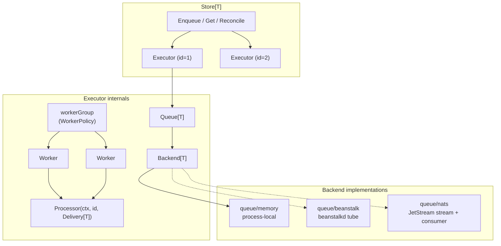
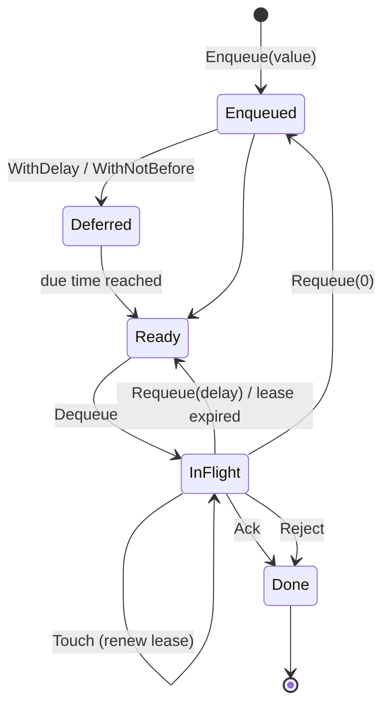
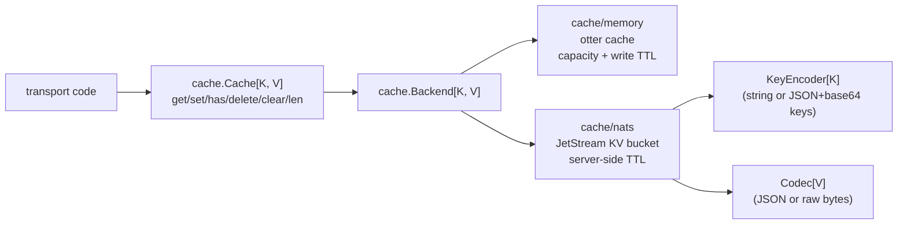
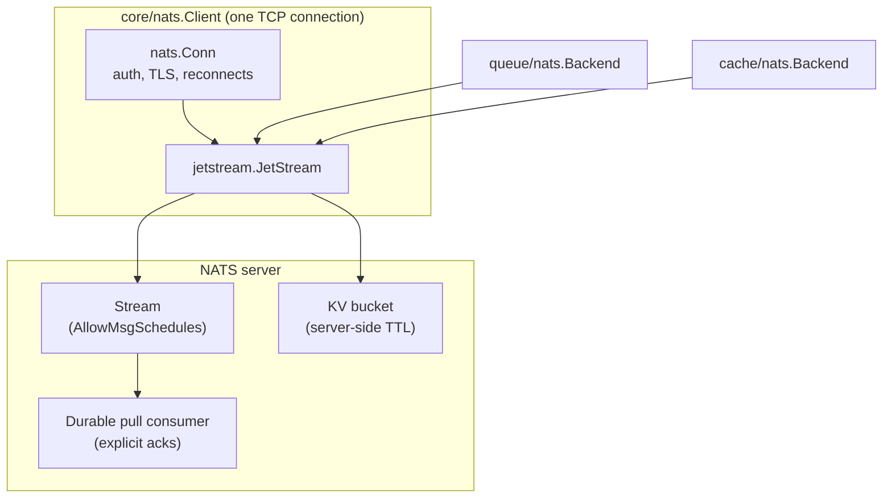

# Architecture overview

This document explains how the library is organized and how the parts connect. Each subsystem has a
dedicated guide with usage examples — see the [documentation index](README.md).

## Layer map

The library is deliberately layered: the engine composes high-level services, while queues, caches,
and the NATS client are standalone subsystems a transport can use independently.

## The engine composition

`core.Engine` is the composition root for the web-facing half of a transport. `Prepare()` wires the
logger, database, Sentry SDK, and localization; `Run()` serves the configured gin router.

Key properties:

- Handlers retrieve the engine from the gin context with `core.GetApp(c)` / `core.MustGetApp(c)` —
  the router injects it automatically.
- The localizer is cloned per request from the `Accept-Language` header; templates get `trans` /
  `transTpl` functions for free.
- Errors captured by the Sentry middlewares are tagged with connection/account IDs taken from the gin
  context, so production issues are traceable to a tenant.

See [Engine & web application](engine.md) for the full walkthrough.

## The queue pipeline

`core/queue` decouples *what* to process (typed items) from *where* they are stored (backends) and
*how* they are consumed (autoscaling worker pools). One `Store` manages one executor per numeric queue
ID — typically a transport account ID.

Delivery lifecycle:

A delivery that reaches the processor is *settled* exactly once. If the processor returns or panics
without settling, the delivery stays pending in the backend and an optional
`WithUnsettledProcessor` hook observes it.

See [Queues](queues.md).

## The cache layers

`core/cache` is a typed facade (`Cache[K, V]`) over interchangeable backends. In-memory backends are
process-local and TTL-bounded; NATS backends store entries in JetStream key-value buckets shared by
every replica of the transport.

See [Cache](cache.md).

## The NATS stack

`core/nats.Client` owns a single NATS connection with JetStream enabled. Queue backends (streams,
durable consumers, message schedules) and cache backends (KV buckets) are built on the same client,
so a transport needs exactly one connection regardless of how many subsystems it uses.

See [NATS integration](nats.md).

## Operational concerns

- **Graceful shutdown** follows the same shape everywhere: close the intake, drain queued work, stop
  workers, release infrastructure. The [engine](engine.md#graceful-shutdown) and
  [queue store](queues.md#graceful-shutdown) both support it.
- **Observability** is structured logging (zap-based `core/logger`) plus Sentry for error reporting,
  Zabbix for metrics, and `Stats`/`Info` methods on queues for workload introspection.
- **Multi-tenancy** is the reason queues are keyed by numeric account IDs: each account gets
  independent backlog, workers, and statistics, and `Store.Reconcile` keeps the executor set in sync
  with the accounts known to the transport.
