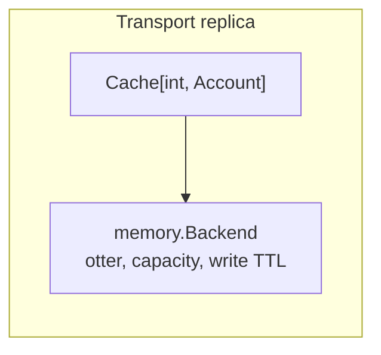
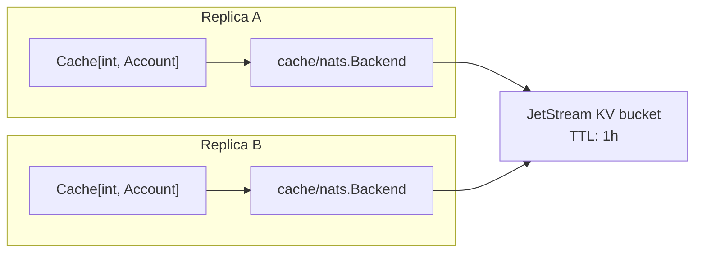

# Cache

The `core/cache` package (with the `core/cache/memory` and `core/cache/nats` subpackages) provides a
typed cache facade over interchangeable backends. Values and keys stay typed in transport code;
storage details (encoding, TTL semantics, sharing) are a backend concern.

## The facade

```go
type Cache[K comparable, V any] // get / set / has / delete / clear / len / close
type VersionedCache[K comparable, V any] // Cache plus revisions / CAS / typed keys
```

```go
backend, err := memory.New[int, Account](memory.Options{
    Capacity: 1_000,
    TTL:      time.Hour,
})
if err != nil {
    return err
}
accounts := cache.New(backend)

_ = accounts.Set(ctx, account.ID, account)
account, found, err := accounts.Get(ctx, accountID)
if !found && err == nil {
    account, err = loadAccount(ctx, accountID) // cache miss: recompute and store
    if err == nil {
        _ = accounts.Set(ctx, account.ID, account)
    }
}
```

All operations take a `context.Context`, and every operation returns `cache.ErrClosed` after
`Close`. `Get` distinguishes a miss (`found == false`, `err == nil`) from a failure (`err != nil`).

## Complete cache-aside example

Cache-aside is the usual application flow: read the cache, load from the authoritative service or
database on a miss, then populate the cache. Writes update the source of truth first and invalidate
the cached copy so a failed database write can never leave a cache-only value behind.

```go
package accounts

import (
    "context"
    "time"

    "github.com/retailcrm/mg-transport-core/v2/core/cache"
    "github.com/retailcrm/mg-transport-core/v2/core/cache/memory"
)

type Account struct {
    ID   int    `json:"id"`
    Name string `json:"name"`
}

type AccountRepository interface {
    Find(context.Context, int) (Account, error)
    Save(context.Context, Account) error
}

type AccountService struct {
    repository AccountRepository
    accounts   *cache.Cache[int, Account]
}

func NewAccountService(repository AccountRepository) (*AccountService, error) {
    backend, err := memory.New[int, Account](memory.Options{
        Capacity: 1_000,
        TTL:      10 * time.Minute,
    })
    if err != nil {
        return nil, err
    }
    return &AccountService{repository: repository, accounts: cache.New(backend)}, nil
}

func (s *AccountService) Account(ctx context.Context, id int) (Account, error) {
    account, found, err := s.accounts.Get(ctx, id)
    if err != nil {
        return Account{}, err
    }
    if found {
        return account, nil
    }

    account, err = s.repository.Find(ctx, id)
    if err != nil {
        return Account{}, err
    }
    if err := s.accounts.Set(ctx, id, account); err != nil {
        return Account{}, err
    }
    return account, nil
}

func (s *AccountService) Rename(ctx context.Context, account Account) error {
    if err := s.repository.Save(ctx, account); err != nil {
        return err
    }
    return s.accounts.Delete(ctx, account.ID)
}

func (s *AccountService) Close(ctx context.Context) error {
    return s.accounts.Close(ctx)
}
```

Concurrent misses may call `Find` more than once; add application-level request coalescing if that is
expensive. Cache failures are treated as request failures above. For a best-effort cache, log `Get`,
`Set`, or `Delete` errors and continue to the repository instead.

## Backends

### memory — process-local

| Option | Meaning |
|---|---|
| `Capacity` | Hard entry limit; must be positive. Excess writes evict via the otter admission policy. |
| `TTL` | Entries expire this long *after being written*. Zero disables expiry. |

The backend is built on the [otter] cache (S3-FIFO), is lock-free, and never blocks on I/O. Entries do
not survive restarts and are invisible to other replicas — use it for re-computable, per-instance data
(connection objects, resolved tokens, idempotent API responses).



### nats — JetStream KV bucket, shared

The NATS backend stores entries in a JetStream key-value bucket. Every process using the same bucket
and client sees the same data, which makes it a building block for cross-replica caches.

```go
client, err := corenats.Connect(ctx, corenats.Config{URLs: cfg.NATSURLs}, log)
if err != nil {
    return err
}

backend, err := nats.New[int, Account](
    ctx, client,
    cache.JSONKeyEncoder[int]{},   // int keys -> base64(JSON) bucket keys
    cache.JSONCodec[Account]{},    // Account -> JSON bytes
    nats.Config{
        Bucket:    jetstream.KeyValueConfig{Bucket: "accounts", TTL: time.Hour},
        Provision: nats.Ensure,
    },
)
if err != nil {
    return err
}
accounts := cache.New[int, Account](backend)
defer func() { _ = accounts.Close(context.WithoutCancel(ctx)) }()

if err := accounts.Set(ctx, account.ID, account); err != nil {
    return err
}
cached, found, err := accounts.Get(ctx, account.ID)
```

Properties to be aware of:

- **TTL is bucket-wide.** The server expires every entry after the bucket's TTL; per-entry TTL is not
  possible. `Provision: BindExisting` validates that the existing bucket's TTL matches the configured
  one and refuses to bind otherwise; `Ensure` creates or updates the bucket (and its TTL).
- **Reads hit the server.** The backend does not watch for updates; a value written by another
  process becomes visible on the next operation.
- **Delete purges** the key so per-key history does not accumulate in the underlying stream.
- **Closing is local.** `Close` only marks the backend closed; the shared NATS client and the bucket
  itself are untouched.

For shared mutable state, wrap the same backend with `cache.NewVersioned`. `Create` reserves an absent
key, `GetEntry` returns its revision, and `Update` / `DeleteRevision` perform optimistic concurrency:

```go
state := cache.NewVersioned[string, DeliveryState](backend)
revision, err := state.Create(ctx, deliveryID, initial)
if errors.Is(err, cache.ErrConflict) {
    current, found, err := state.GetEntry(ctx, deliveryID)
    // Resolve the conflict or retry an Update with current.Revision.
}
_, err = state.Update(ctx, deliveryID, completed, revision)
keys, err := state.Keys(ctx)
```

A complete compare-and-swap update retries when another replica wins the race:

```go
func markCompleted(ctx context.Context, state *cache.VersionedCache[string, DeliveryState], id string) error {
    for range 5 {
        current, found, err := state.GetEntry(ctx, id)
        if err != nil {
            return err
        }
        if !found {
            _, err = state.Create(ctx, id, DeliveryState{Status: "completed"})
        } else {
            current.Value.Status = "completed"
            _, err = state.Update(ctx, id, current.Value, current.Revision)
        }
        if err == nil {
            return nil
        }
        if !errors.Is(err, cache.ErrConflict) {
            return err
        }
    }
    return cache.ErrConflict
}
```

Use the ordinary facade for disposable cached data and the versioned facade only when the KV bucket
is acting as shared mutable state. The memory backend does not implement revisions.

`BindExisting` validates TTL, history, replicas, and storage. `Keys` requires a key converter that
also implements `cache.KeyDecoder`; both built-in key encoders do.



## Keys and values on persistent backends

Bucket keys are strings and stored values are bytes, so the NATS backend takes two converters:

| Converter | Behavior |
|---|---|
| `cache.StringKeyEncoder{}` | Passes `string` keys through unchanged. |
| `cache.JSONKeyEncoder[K]{}` | Serializes any comparable key to JSON and base64-encodes it, keeping it safe for the key space. |
| `cache.JSONCodec[V]{}` | Values as encoding/json/v2. |
| `cache.BytesCodec{}` | Pass `[]byte` values through (already-encoded payloads). |

Custom encodings plug in by implementing `cache.KeyEncoder[K]` or `cache.Codec[V]`. Implement
`cache.KeyCodec[K]` when typed key listing is required.

For data already encoded by the application, no JSON layer is needed:

```go
backend, err := nats.New[string, []byte](
    ctx, client,
    cache.StringKeyEncoder{},
    cache.BytesCodec{},
    nats.Config{
        Bucket:    jetstream.KeyValueConfig{Bucket: "rendered_messages", TTL: 15 * time.Minute},
        Provision: nats.Ensure,
    },
)
if err != nil {
    return err
}
rendered := cache.New[string, []byte](backend)
if err := rendered.Set(ctx, templateID, encodedMessage); err != nil {
    return err
}
encodedMessage, found, err = rendered.Get(ctx, templateID)
```

`BytesCodec` clones byte slices while encoding and decoding, so callers do not share the backend's
storage buffer.

## Choosing a backend

| Need | Backend |
|---|---|
| Cheap per-instance cache, misses re-computable | `memory` |
| Shared across replicas / survive restarts | `nats` |
| Per-entry TTL | `memory` |
| Server-enforced uniform TTL | `nats` |

[otter]: https://github.com/maypok86/otter
