# Engine & web application

The `core` package provides `Engine`, the composition root for the web-facing half of a transport:
configuration, routing, localization, templates, sessions, CSRF, error reporting, background jobs,
and database access.

## Bootstrap

```go
app := core.New(core.AppInfo{Version: "v1.0", Commit: "bcef82e", Build: "v1.0-bcef82e", BuildDate: "1649766442"})

app.Config = core.NewConfig("config.yml") // panics on unreadable/invalid config
app.DefaultError = "unknown_error"        // localized message ID used to mask internal errors
app.TranslationsPath = "./translations"
app.PreloadLanguages = core.DefaultLanguages

app.ConfigureRouter(func(engine *gin.Engine) {
    engine.HTMLRender = app.CreateRenderer(
        func(renderer *core.Renderer) {
            renderer.Push("home", "templates/layout.html", "templates/home.html")
        },
        template.FuncMap{},
    )
})

if err := app.Prepare().Run(); err != nil {
    log.Fatal(err)
}
```

`Prepare()` is idempotent-protected (it panics when called twice) and performs the fixed wiring:
translations, database, logger, and Sentry. Handlers fetch the engine from the gin context:

```go
func handler(c *gin.Context) {
    app, ok := core.GetApp(c)
    if !ok {
        c.Status(http.StatusInternalServerError)
        return
    }
    // use app.Localizer, app.Logger(), app.Utils, ...
}
```

## What the engine wires

```mermaid
flowchart LR
    subgraph Engine["core.Engine"]
        direction TB
        CFG["Config<br/>(core/config, YAML)"]
        LOC["Localizer<br/>(i18n, per-request clones)"]
        TPLR["Renderer<br/>(multitemplate)"]
        SEN["Sentry<br/>(scoped captures)"]
        JM2["JobManager<br/>(background jobs)"]
        ORM["db.ORM<br/>(GORM/Postgres)"]
        UTIL["util.Utils<br/>(API client, S3, tokens)"]
        HTTP["HTTP client + server"]
    end

    REQ["HTTP request"] --> MW["middleware stack<br/>Sentry + localization (+CSRF, custom)"]
    MW --> HANDLERS["transport handlers"]
    HANDLERS --> Engine
```



### Configuration (`core/config`)

`core.NewConfig(path)` parses a YAML file into `config.Config`, which exposes typed accessors
(`GetHTTPConfig`, `GetDBConfig`, `GetSentryDSN`, `IsDebug`, ...). Transports with their own config
format implement the `config.Configuration` interface instead and assign it to `app.Config`.

### Localization

Translations are YAML message catalogs, loaded from a directory or an embedded `fs.FS`
(`app.TranslationsFS`). The `LocalizationMiddleware` clones the localizer per request and selects the
language from `Accept-Language`; handlers read it via `core.GetContextLocalizer(c)`. Templates
receive `trans`/`transTpl` functions through `app.TemplateFuncMap`. Localized HTTP error payloads are
one call away: `status, body := app.BadRequestLocalized("bad_request")`, and friends for 401/403/500
(return the pair from a handler with `c.JSON(status, body)`).

### Templates

`app.CreateRenderer` / `app.CreateRendererFS` build a `Renderer` over gin's multitemplate renderer.
`renderer.Push(name, files...)` registers a page; with `CreateRendererFS` the paths are relative to
the embedded filesystem, which pairs well with `//go:embed`.

### Sessions & CSRF

```go
app.WithCookieSessions()               // or WithFilesystemSessions(path)
app.InitCSRF(secret, abortFunc, middleware.DefaultCSRFTokenGetter)

app.Router().Use(app.GenerateCSRFMiddleware())
app.Router().Use(app.VerifyCSRFMiddleware(core.DefaultIgnoredMethods))
token := app.GetCSRFToken(c)
```

### Sentry error reporting

`app.Prepare()` initializes the Sentry SDK from config. `app.SentryMiddlewares()` (installed
automatically) tag captured events with connection/account IDs found in the gin context, recover
panics, and return a localized JSON error to the client. Capture explicitly with
`app.CaptureException(c, err)` — wrap errors with `stacktrace.AppendToError` to attach a stack trace.

### Job manager

Named background jobs with panic isolation, sequential chaining, and interval ticking:

```go
jm := app.JobManager()
err := jm.RegisterJob("refreshTokens", &core.Job{
    Command:  func(log logger.Logger) error { return refreshTokens(ctx, log) },
    Regular:  true,
    Interval: time.Hour,
})
jm.Start()
```

One-shot variants: `RunJobOnce`, `RunJobOnceSync`, `RunJobsOnceSequentially`.

### Database & migrations

`app.Prepare()` opens the PostgreSQL connection described by `config.GetDBConfig()` into `app.ORM`.
Migrations self-register in package `init()` functions and are applied with:

```go
db.Migrations().SetDB(app.ORM.DB).Migrate()
```

Generate new migration files with `transport-core-tool migration` (see the
[package reference](packages.md#cmdtransport-core-tool)).

### HTTP client

`app.BuildHTTPClient(certPool)` builds an `*http.Client` from the config (timeout, SSL verification,
proxying with split-tunnel support) and `app.HTTPClient()` returns it. For full control use
`util/httputil.NewHTTPClientBuilder()` directly.

## Health monitoring (`core/healthcheck`)

Track per-account API success rates and notify CRM administrators when an integration degrades:

```go
storage := healthcheck.NewSyncMapStorage(healthcheck.NewAtomicCounter)

// around every CRM API call for account 42:
counter := storage.Get(42, "crm")
counter.HitSuccess() // or counter.HitFailure(); counter.Failed(msg) on fatal errors

// periodically, e.g. from a JobManager job:
storage.Process(healthcheck.CounterProcessor{
    Notifier:               healthcheck.DefaultNotifyFunc,
    ConnectionDataProvider: func(id int) (string, string, string, bool) { return apiURL, apiKey, lang, true },
    Localizer:              &app.Localizer,
    MinRequests:            healthcheck.DefaultMinRequests,
    FailureThreshold:       healthcheck.DefaultFailureThreshold,
})
```

Counters reset every 15 minutes; alerts fire when the success ratio drops below 0.8 with at least 10
requests, and are deduplicated until the counter resets.

## Structured logging (`core/logger`)

`app.Logger()` is a zap-based `logger.Logger` with transport-specific scoping:

```go
log := app.Logger().ForConnection(connectionID).ForAccount(accountID)
log.Info("sending message", logger.Handler("whatsapp"), zap.String("messageId", id))
```

`logger.GinMiddleware(log, skipPaths...)` adds per-request logging with a generated `streamId`.
Adapters route third-party output (API clients, Zabbix collector, plain `io.Writer`) into the same
pipeline.

## Graceful shutdown

```go
sigCh := make(chan os.Signal, 1)
signal.Notify(sigCh, syscall.SIGTERM, syscall.SIGINT)

go func() {
    if err := app.Run(); err != nil {
        log.Error("server failed", zap.Error(err))
    }
}()

<-sigCh
jobs.CloseIntake()                                 // stop accepting new queue work (docs/queues.md)
_ = jobs.Drain(drainCtx)                           // wait for queued work to finish
_ = jobs.Stop(stopCtx)                             // stop workers and backends
_ = app.Shutdown(shutdownCtx)                      // graceful HTTP server shutdown
```

`app.Shutdown(ctx)` delegates to `http.Server.Shutdown`; pair it with queue draining so in-flight
requests that enqueue work complete before workers stop.
