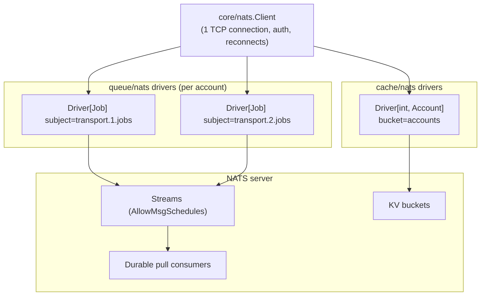

# NATS integration

NATS (with JetStream) backs the durable queue and shared cache subsystems of the library. The
`core/nats` package owns the connection so that every consumer shares it.

## Connecting

```go
import corenats "github.com/retailcrm/mg-transport-core/v2/core/nats"

client, err := corenats.Connect(ctx, corenats.Config{
    URLs: []string{"nats://nats-1:4222", "nats://nats-2:4222"},
    Name: "my-transport",
    Auth: corenats.Auth{
        CredentialsFile: "/etc/nats/transport.creds", // exactly one auth method
    },
    ConnectTimeout: 2 * time.Second,
    MaxReconnects:  60,
}, log)
if err != nil {
    return err
}
defer func() { _ = client.Drain(context.Background()) }()
```

`Connect` normalizes defaults (2s connect timeout, 2s reconnect wait, 30s drain timeout, 60 reconnect
attempts, `nats://localhost:4222` when no URLs are given), installs logging handlers for disconnect /
reconnect / close events on the provided logger, and exposes both the raw connection and a JetStream
context:

```go
client.Conn       // *nats.Conn          — plain pub/sub if you need it
client.JetStream  // jetstream.JetStream — streams, consumers, KV buckets
```

### Authentication

Exactly one method may be configured; mixing them fails fast:

| Method | Fields |
|---|---|
| Username/password | `Auth.Username`, `Auth.Password` |
| Token | `Auth.Token` |
| Credentials file | `Auth.CredentialsFile` |
| NKey seed file | `Auth.NKeySeedFile` |
| JWT + seed | `Auth.UserJWT` and `Auth.JWTSeedFile` (both required) |

TLS is enabled by setting `Config.TLS`; extra `nats.go` options can be appended as variadic
arguments to `Connect`.

### Shutdown

- `client.Drain(ctx)` — flush pending messages, let subscriptions settle; falls back to a hard close
  when the context expires. Preferred during graceful shutdown.
- `client.Close()` — immediate close, discarding buffers.

## One connection, many subsystems

Queue and cache drivers accept the shared client instead of dialing their own connections:



Closing a driver never closes the shared client — connection lifetime belongs to the transport
bootstrap code.

## Provisioning modes

Both NATS drivers select their provisioning behavior with a `ProvisionMode`:

| Mode | Behavior |
|---|---|
| `Ensure` | Create or update the stream/consumer (queues) or bucket (cache) from the configuration. |
| `BindExisting` | Bind to pre-provisioned resources and *validate* their configuration; create nothing. |

`BindExisting` is intended for environments where infrastructure is managed externally (Terraform,
operators) and applications run with reduced permissions. Queue binding requires message schedules
unless explicitly disabled and a consumer with explicit acknowledgments on the configured subject;
cache binding checks TTL, history, replicas, and storage.

Legacy queues can opt into raw codec payloads and disable enqueue scheduling. NATS queues can also
provision or bind a separate DLQ stream. The NATS cache additionally implements the versioned cache
contract (create-if-absent, CAS update/delete, revision metadata, and typed key listing), which can be
used for delivery state, leases, and shared counters.

## Where to go next

- Durable queues with schedules and durable consumers: [Queues](queues.md#drivers).
- Shared typed caches with server-side TTL: [Cache](cache.md#nats--jetstream-kv-bucket-shared).
