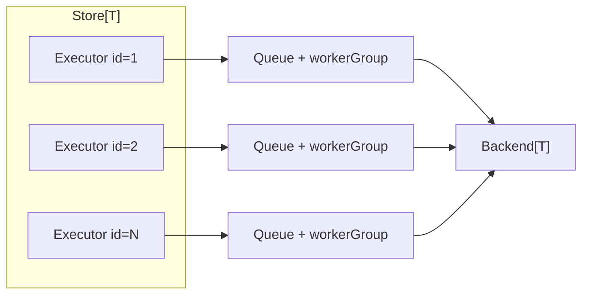
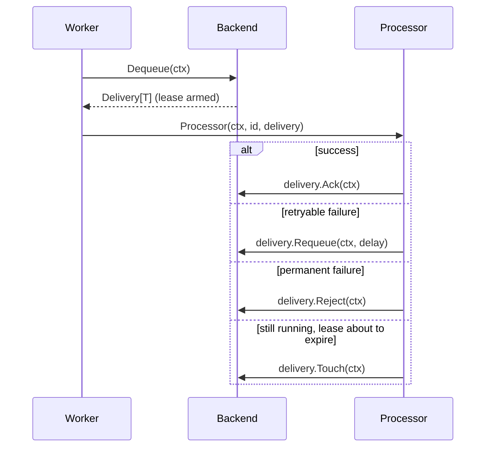

# Queues

The `core/queue` package (with the `core/queue/memory`, `core/queue/beanstalk`, and `core/queue/nats`
subpackages) provides typed job queues with explicit delivery settlement, autoscaling worker pools,
and a multi-queue store keyed by account ID.

## Concepts

| Concept | Type | Role |
|---|---|---|
| Store | `queue.Store[T]` | Owns one executor per numeric queue ID; creates them lazily; aggregates stats. |
| Executor | `queue.Executor[T]` | Operates one queue end to end: enqueue, info, drain, close. |
| Queue | `queue.Queue[T]` | Wraps a backend with lifecycle guards (intake close, dequeue cancellation). |
| Backend | `queue.Backend[T]` | Stores items and hands out deliveries. Selected per transport deployment. |
| Delivery | `queue.Delivery[T]` | A dequeued item plus metadata and settlement methods. |
| Processor | `queue.Processor[T]` | The callback that consumes deliveries. |
| Worker policy | `queue.WorkerPolicy` | Scaling bounds, ratio, idle timeout, restart delay. |



## Creating a store

A store needs three things: a backend constructor (called lazily per queue ID, so backends can be
bound to the account), a processor shared by all queues, and a worker policy.

```go
type Job struct {
    AccountID int
    Payload   string
}

backendFor := func(ctx context.Context, accountID int) (queue.Backend[Job], error) {
    return memory.New[Job](memory.Options{AckWait: 30 * time.Second}), nil
}

process := func(ctx context.Context, accountID int, delivery queue.Delivery[Job]) {
    job := delivery.Value()
    if err := handle(ctx, job); err != nil {
        // Retry after a minute; the attempt counter grows on every redelivery.
        _ = delivery.Requeue(ctx, time.Minute)
        return
    }
    _ = delivery.Ack(ctx)
}

jobs, err := queue.NewStore(
    backendFor,
    process,
    queue.WorkerPolicy{
        MinWorkers:    1,
        MaxWorkers:    10,
        JobsPerWorker: 10,             // aim for one worker per 10 ready items
        IdleTimeout:   time.Minute,    // worker retires after a minute without work
        ScaleInterval: time.Second,    // periodic scaling tick
        RestartDelay:  time.Second,    // throttle worker replacement after failures
    },
)
```

### Enqueuing

```go
err := jobs.Enqueue(ctx, accountID, job,
    queue.WithID(job.ID),        // stable ID: enables deduplication on supporting backends
    queue.WithDelay(5*time.Min), // or queue.WithNotBefore(deadline)
)
```

Deliveries carry `queue.Metadata` (ID, enqueue/deliver times, attempt number), which processors can
use to cap retries.

### Custom scaling

`JobsPerWorker` covers the common ratio-based scaling. For full control, provide a
`DesiredWorkersFunc`; its result is still clamped to `[MinWorkers, MaxWorkers]`:

```go
policy := queue.WorkerPolicy{
    MinWorkers:   1,
    MaxWorkers:   32,
    IdleTimeout:  time.Minute,
    ScaleInterval: 5 * time.Second,
    DesiredWorkers: func(info queue.ScaleInfo) int {
        if info.Stats.Ready > 1000 {
            return info.ActiveWorkers * 2
        }
        return int(info.Stats.Ready / 50)
    },
}
```

Scaling runs on every enqueue notification and on every `ScaleInterval` tick, so persisted or
remotely published work is discovered even without local enqueues.

## Delivery lifecycle and settlement

Every dequeued item must be settled exactly once:



- **Ack** — work is done; the item is removed.
- **Requeue(delay)** — schedule another attempt; `Metadata.Attempt` increases on redelivery.
- **Reject** — drop the item entirely (on JetStream backends the message is terminated).
- **Touch** — renew the backend lease for long-running processing; does not settle the delivery.

Calling a settlement method twice returns `queue.ErrDeliverySettled`. If a processor returns or
panics without settling, the delivery remains pending in the backend (the lease eventually expires
and the backend redelivers it). To observe — and optionally handle — such cases:

```go
jobs, err := queue.NewStore(backendFor, process, policy,
    queue.WithUnsettledProcessor(
        func(ctx context.Context, id int, delivery queue.Delivery[Job], cause queue.UnsettledCause) {
            log.Warn("unsettled delivery",
                zap.Uint64("attempt", delivery.Metadata().Attempt),
                zap.Uint8("cause", uint8(cause.Kind)),
            )
            _ = delivery.Reject(ctx)
        },
    ),
    queue.WithPanicHandler(
        func(ctx context.Context, id int, delivery queue.Delivery[Job], recovered any) {
            log.Error("processor panicked", zap.Any("panic", recovered))
        },
    ),
)
```

`cause.Kind` is `queue.UnsettledReturned` or `queue.UnsettledPanicked` (with the recovered value in
`cause.Panic`).

## Backends

### memory (process-local)

`core/queue/memory` keeps ready, deferred, and in-flight items in the process. No codec is needed
(items are stored as-is); delayed items are scheduled with an internal heap, and leases are enforced
by timers. State is lost on restart — suitable for tests and re-creatable work.

```go
backend := memory.New[Job](memory.Options{AckWait: 30 * time.Second})
```

### beanstalk (durable)

`core/queue/beanstalk` maps queues onto beanstalkd tubes. A `Manager` owns two dedicated connections
(producer and consumer) and reconnects them automatically on network errors.

```go
manager, err := beanstalk.NewManager(ctx, "beanstalkd:11300", "transport.jobs", log, time.Second)
if err != nil {
    return err
}
defer func() { _ = manager.Close() }()

backendFor := func(ctx context.Context, accountID int) (queue.Backend[Job], error) {
    return beanstalk.New[Job](manager, queue.JSONCodec[Job]{}, beanstalk.Options{
        Priority: 1,
        TTR:      time.Minute, // delivery lease
    }), nil
}
```

`Reject` is aliased to `Ack` (beanstalkd has no poison-message concept), and native tube delays back
`Requeue`/`WithDelay`.

### nats (durable, JetStream)

`core/queue/nats` publishes items to a JetStream stream and consumes them through a durable pull
consumer with explicit acknowledgments. Deferred items use JetStream *message schedules*: the server
holds the message under `<subject>.schedule.<token>` and moves it to the queue subject at due time,
which requires `AllowMsgSchedules: true` on the stream.

```go
client, err := corenats.Connect(ctx, corenats.Config{URLs: cfg.NATSURLs}, log)
if err != nil {
    return err
}

backendFor := func(ctx context.Context, accountID int) (queue.Backend[Job], error) {
    return nats.New[Job](ctx, client, queue.JSONCodec[Job]{}, nats.Config{
        Subject: fmt.Sprintf("transport.%d.jobs", accountID),
        Stream: jetstream.StreamConfig{
            Name:              "TRANSPORT_JOBS",
            AllowMsgSchedules: true,
        },
        Consumer:  jetstream.ConsumerConfig{Name: "transport-jobs"},
        Provision: nats.Ensure, // or nats.BindExisting for externally managed infrastructure
    })
}
```

The enqueue ID is used as the JetStream message ID, giving publisher-side deduplication. `Stats` maps
consumer pending (Ready), scheduled messages (Deferred), and unacknowledged deliveries (InFlight).

### Codecs

Persistent backends serialize items with a `queue.Codec[T]`:

- `queue.JSONCodec[T]{}` — encoding/json/v2, the default choice.
- `queue.BytesCodec{}` — pass-through for already-encoded payloads.
- `queue.FuncCodec[T]{}` — adapt functions, e.g. to restore runtime-only dependencies after decode:

```go
codec := queue.FuncCodec[*Task]{
    EncodeFunc: queue.JSONCodec[*Task]{}.Encode,
    DecodeFunc: func(data []byte) (*Task, error) {
        task, err := queue.JSONCodec[*Task]{}.Decode(data)
        if err == nil {
            err = hydrateTask(accountID, task)
        }
        return task, err
    },
}
```

## Keeping queues in sync with accounts

Transports usually run one queue per connected account. `Reconcile` aligns the executor set with the
desired account list and is safe to call periodically (for example from a JobManager job):

```go
accounts := loadActiveAccounts(ctx) // []int of account IDs
if err := jobs.Reconcile(ctx, accounts); err != nil {
    log.Error("reconcile failed", zap.Error(err))
}
```

Executors for accounts missing from the list are closed and removed; new accounts get executors
lazily or eagerly, created through the backend constructor.

## Observability

```go
stats, err := jobs.Stats(ctx) // aggregated across executors
// stats.Ready, stats.Deferred, stats.InFlight, stats.Queued()

info, ok, err := jobs.Info(ctx, accountID) // per executor
// info.LastEnqueueTime, info.Stats, info.ActiveWorkers
```

## Graceful shutdown

The store supports the standard three-phase shutdown:

```go
jobs.CloseIntake()              // 1. reject new enqueues (ErrIntakeClosed from now on)
if err := jobs.Drain(ctx); err != nil { // 2. wait until queues are empty
    return err
}
return jobs.Stop(ctx)           // 3. cancel workers, close backends
```

`Executor` exposes the same phases for a single queue (`CloseIntake`, `Drain`, `Close`). `Stop` is
final: after it succeeds, `Get` returns `context.Canceled`.

## Custom workers

Worker creation goes through a `queue.WorkerFactory`. Override it with `queue.WithWorkerFactory` to
wrap the default worker with instrumentation or to replace the consumption strategy entirely. A
`Worker` runs until it reports `queue.WorkerIdle` (retirable) or `queue.WorkerStopped` (will be
restarted after `RestartDelay`).
